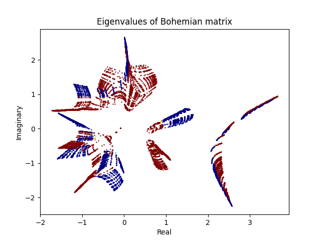
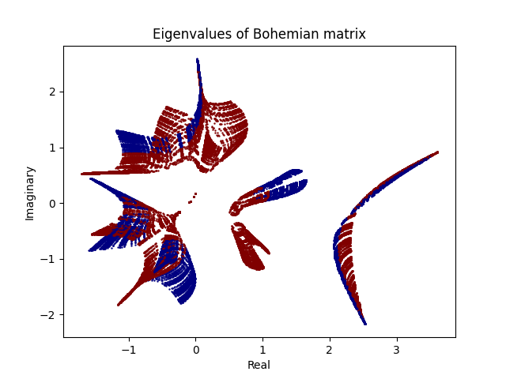

# Bohemian Matrices
In this simple notebook, we try to visualize the eigen values of a Bohemian Matrix. The Bohemian matrix is a matrix with the following form:

$$ Bohemian = 
\begin{bmatrix}
    0, 1, 1, 1, A \\
    0, 0, 0, B, 0 \\
    1, 1, 1, 0, 0 \\
    0, 1, 1, 1, 1 \\
    0, 1, 0, 0, 0 \\
\end{bmatrix}
$$

Where $A$ and $B$ are sampled independently from a uniform distribution between $0$ and $1$. let's call this distribution $X$. We have:
$A = (7 + 9j) * X - (3 + 5j)$

$B = (7 + 9j) * X - (3 + 5j)$

Visualizing the eigen values of this matrix is interesting! You can see a sample result with $NUM\_SAMPLES = 50$ below:

Also the result with $NUM\_SAMPLES = 100$ is:

You can choose specific distributions for which X can be come from. By changing the distribution and the number of samples, you can see different results. For a sample of count 5 million, you can refer to [here](http://www.bohemianmatrices.com/gallery/Eigenfish_4/).
